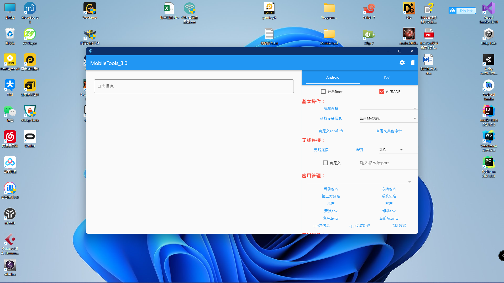
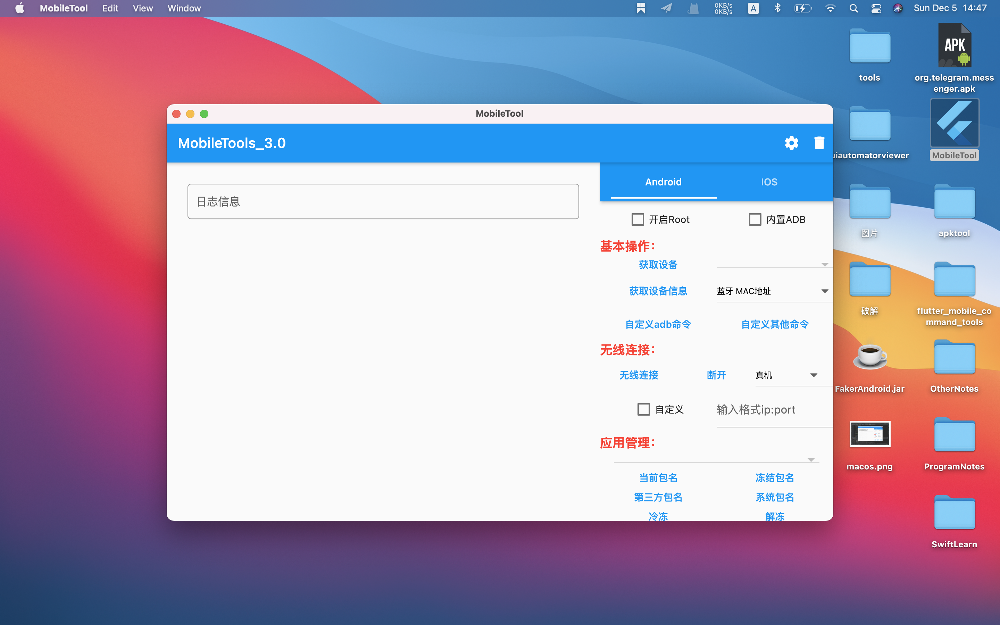

# MobileTool
超级方便的adb命令工具，支持所有桌面端，不管你是开发还是测试，都可以试试看。

## 说明
+ 关于Android
  
  请自行打开手机开发者模式中的USB调试，确保手机和电脑能连接上。确保能使用adb连接上。。本工具Android模块只是将adb的大部分命令进行了懒人模式，有问题欢迎提issues。
  
+ 关于IOS
  
  使用[libimobiledevice](https://github.com/libimobiledevice/libimobiledevice)，IOS意义不是很大。就写了几个小功能。用爱思吧。

+ 关于配置文件和工具
  
  - 本地文件路径
  
    1. Windows：C:\Users\用户名\Documents\MobileTools 
    2. Linux：/home/用户名/Documents/MobileTools  
    3. Windows：/Users/用户名/Documents/MobileTools
  
  - MobileTools的目录结构
  
    1. apksigner文件夹（签名文件）
    2. config文件夹（用于保存一些信息）
    3. tools文件（包含内置的一些文件）
    4. VERSION文件（当前软件的版本号）
  
  如果需要使用反编译，以及获取当前界面的焦点的工具，几个工具太大。保存到了百度云盘，需要的可以放到tools文件夹下面。[链接](https://pan.baidu.com/s/1Q9CQEzFSo_RLl7PaEETmyw)，提取码：0dpp。
## 功能

### 设置

+ adb（选择本机的adb文件，以防止和内部adb冲突）
+ java（部分命令需要java环境，如果你不想配置环境变量，可以选择java文件）
+ libimobiledevice（IOS的环境，感觉用处不是很大）


### Android
+ 开启Root
  如果手机有Root权限，可以打开，在获取信息的时候使用到。如果手机有Magisk，可以安装这个插件[adb_root](https://github.com/evdenis/adb_root)，可以让所有的命令都走root权限。
  
+ 内置ADB
  如果你的电脑没有adb，打开这个开关会使用内置的adb。如果你电脑本身有adb，点击右上角的配置，配置adb路径，以免内置的adb和你安装的adb冲突。
  
+ 基本操作
  - 获取设备
    获取当前所有连接的Android设备，展示在下拉框里面（如果当前只有单一设备，也可以不获取）
  - 获取设备信息
    选择，然后点击获取信息，部分信息在高版本的手机上面需要Root权限
  - 自定义adb命令（3.0新增）
    本软件没有涉及带的命令，可以添加保存，下次使用
  - 自定义其他命令（3.0新增）
    相关其他终端命令，可以添加保存，下次使用
  
+ 无线连接
  - 无线连接
    选择真机，非自定义的情况下会去获取当前真机的ip，获取成功直接去连接，获取失败，需要自定义去填入ip:port。选择其他模拟器设备，默认内置了所有模拟器的第一台设备的端口。然后点击无线连接就ok了。
  - 断开
    只能断开无线连接的设备和模拟器
  
+ 应用管理

  + 当前包名
    获取当前展示的app包名，展示在上面的下拉框里面。
  + 冻结包名（3.0新增）
    获取所有冻结的app包名，展示在上面的下拉框里面。
  + 第三方包名（2.0新增）
    获取当前所有第三方的app包名，展示在上面的下拉框里面。
  + 系统包名（2.0新增）
    获取当前所有系统的app包名，展示在上面的下拉框里面。
  + 冷冻（3.0新增）
    对当前选择的包名对应的apk进行冷冻
  + 解冻（3.0新增）
    先获取所有冻结的包名，然后选择包名，进行解冻
  + 安装apk
    选择本地的apk文件安装到手机上面
  + 卸载apk
    卸载当前获取到包名的apk。
  + 主Activity（3.0新增）
    获取当前包名的启动Activity类名。
  + 当前Activity（3.0新增）
    当前正在展示的Activity类名。
  + app包信息（2.0新增）
    当前获取到包名的app信息，可以复制部分信息为应用交互做准备。
  + apk安装路径
    当前获取到包名的app路径。
  + 清除数据
    清除当前获取到包名的缓存数据。
  
+ 应用信息（3.0新增）
  
  + 内部包名和外部apk
    选择内部包名需要先获取包名，然后点击下面的按钮，选择外部apk，点击下面的按钮会弹窗让你选择apk
  + apk包信息
    获取app的包信息（包含app包名、app名字、app版本、app启动类）
  + apk权限
    获取apk需要的权限信息
  
+ 应用交互（2.0新增）
  
  以下3.0版本都对其进行了本地保存，可以自行添加，以供下次使用。存储在config文件夹下面。
  
  - 启动Activity
    弹窗输入要启动的Activity名字，如果没有输入将启动当前获取包名的app。（关于启动类可以通过主Activity包信息获取）
  - 发送BroadcastReceiver
    弹窗输入要启动的广播，下面也列出了部分系统广播，用于测试很难出现的广播。
  - 发送Service
    弹出输入要启动的Service
  - 停止Service
    弹出输入要通知的Service
  
+ 文件管理
  - 推送文件
    选择文件推送到当前设备，默认推送位置/data/local/tmp。点击自定义路径，可以输入你想推送的路径。
  + 拉取文件
    从当前设备拉取文件到桌面。
    1. 手机crash
       点击手机crash，将收集所有crash日志，展示出来，然后选择时间点点击拉取crash。会推送到桌面
    2. 拉取文件
       只是为了拉取文件。需要先配置搜索的文件路径，然后点击搜索，会搜索该路径下的所有文件。然后再点击拉取文件。也会推送到桌面。
    3. 拉取anr
       直接点击，会直接拉取anr日志到桌面（时间有点长，耐心等待）
  
+ 模拟操作
  你可以使用大部分模拟命令。
  
  + 打开获取焦点工具（3.0新增，需要java环境。需要从云盘获取工具放到tools文件夹）
    
  + 添加指令文件
    支持4类指令。滑动、点击、文本、所有按键（参考[adb_simulate_code.txt](adb_simulate_code.txt)文件）    
  + 刷新指令文件（3.0新增）
    修改之后。可以直接刷新指令，直接使用
  + 执行指令  
    用户执行指令的按钮
  + 停止指令 
    只有在开启循环时有效。表示停止执行循环
  
+ 逆向相关（3.0新增，需要java环境。需要从云盘获取工具放到tools文件夹）
  
  + Apktool拆包
    使用apktool进行拆包。详情见[Apktool](https://ibotpeaches.github.io/Apktool/)
  + ApkTool合包
    使用apktook进行合包。详情见[Apktool](https://ibotpeaches.github.io/Apktool/)
  + FakerAndroid
    使用FakerAndroid进行拆包可以二次开发的gradle项目。详情见[FakerAndroid](https://github.com/Efaker/FakerAndroid)
  
+ 刷机相关
  
  + 重启手机
    重新启动手机
  + 重启到fastboot
    重启手机到fastboot模式
  + 重启到recovery
    重启手机到recovery模式
  
+ 实用操作
  
  + 截屏（2.0修改）
    截取当前设备的界面，并且推送到桌面（命名 当前时间.png）
  + 录屏（2.0修改）
    录取当前屏幕，需要先设置时间，完成后推送到桌面（命名 当前时间.mp4）
  + v2签名
    使用apksigner的签名。可以进行替换，保证文件名一样。apksigner.json为签名的key以及密码。替换记得修改。
  + 前面校验
    校验apk的签名信息
### IOS

IOS意义不是很大，简单写了几个命令。要下itunes，还有下面的工具，提供获取设备，获取包名，安装和卸载ipa。直接用爱思吧。

+ [libimobiledevice-windows](https://github.com/libimobiledevice-win32/imobiledevice-net)
+ [libimobiledevice](https://github.com/libimobiledevice/libimobiledevice)

## 编译
所有平台应用都改成了占当前屏幕的2/3，采用居中显示，linux没有居中，GTK没搞过。
+ windows

  ```
  安装Visual Studio,c++桌面包。
  flutter build windows  //进行编译。
  在build/windows/runner 会生成Visual Studio的解决方案工程，可以导入进行开发。
  生成的exe在build/windows/runner/Release/*.exe
  ```

+ linux

  ```
  //linux需要安装以下依赖
  sudo apt-get update
  sudo apt install clang
  sudo apt install cmake
  sudo apt install ninja-build
  sudo apt install libgtk-3-dev
  
  
  file INSTALL cannot copy file  //出现这个问题
  flutter clean  //执行这个然后重启AndroidStudio
  
  flutter build linux //生成release包,文件在build/linux/release/bundle下面

  使用adb出现adb devices => no permissions (user in plugdev group; are your udev rules wrong?) [duplicate]
  参考地址解决：https://stackoverflow.com/questions/53887322/adb-devices-no-permissions-user-in-plugdev-group-are-your-udev-rules-wrong

  ```

+ macos

  ```
  安装Xcode，然后在编译的时候遇到很多小问题。然后百度解决了，其中一个
  [tool_crash] Invalid argument(s): Cannot find executable for /Users/imac/Documents/FlutterSDK/flutter/bin/cache/artifacts
  解决方案：https://github.com/flutter/flutter/issues/85107
  
  flutter build macos //生成release包,文件在build/macos/Build/Products/Release/下面
  将mac目录下的文件倒入xcode可进行开发
  ```
  

## 截图展示
+ windows（1920*1080）


+ linux (1920*1080)


+ macos (1440*960)

