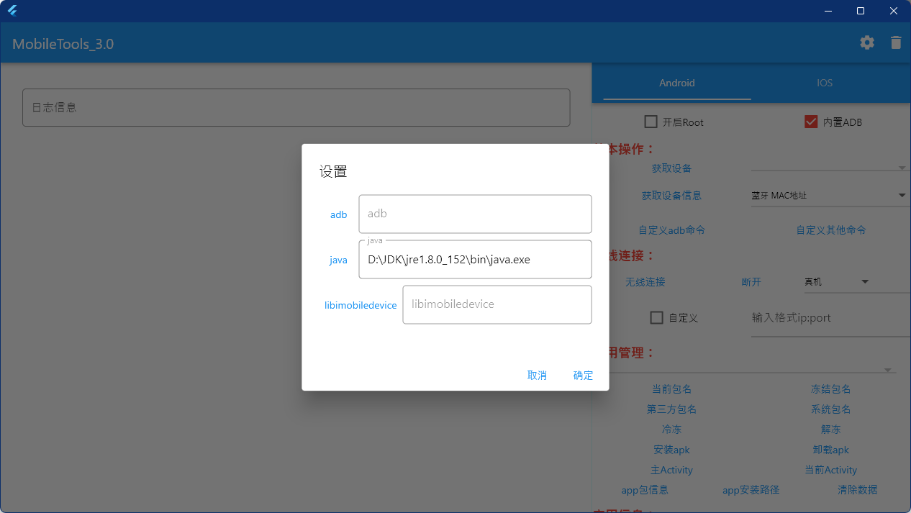
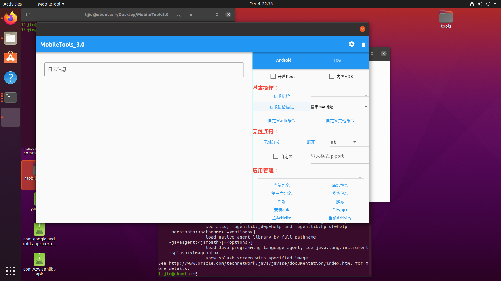

# MobileTool
最近没事学习了一波flutter，移动端没想到写啥。就写了一个桌面端应用。也是之前项目的一个衍生。之前用c#写过一个使用adb操作Android手机的windows应用，主要就是为了简化操作。现在把这个功能转移到所有桌面应用来，并且修复之前的一些遗留的BUG。

如果有其他adb功能需要添加的可以提。

## 说明

+ 关于Android

  请自行打开手机开发者模式中的USB调试，确保手机和电脑能连接上。确保能使用adb连接上。本地化路径保存在Documents目录下面，包含tools文件夹（相关工具文件）和SETTING文件（配置文件）。本工具Android模块只是将adb的大部分命令进行了懒人模式，有问题欢迎提issues。

## 功能

### Android

+ 开启Root
  
  如果手机又Root权限，可以打开，在获取信息的时候使用到。如果手机有Magisk，可以安装这个插件[adb_root](https://github.com/evdenis/adb_root)，可以让所有的命令都走root权限。

+ 内置ADB
  
  如果你的电脑没有adb，打开这个开关会使用内置的adb。如果你电脑本身有adb，点击右上角的配置，配置adb路径，以免内置的adb和你安装的adb冲突。

  - 外部ADB路径设置
  
    
  
+ 基本操作
  
  - 获取设备
  
    获取当前所有连接的Android设备，展示在下拉框里面（大部分功能都需要先获取设备）
  
  - 获取设备信息
  
    选择，然后点击获取信息，部分信息在高版本的手机上面需要Root权限
  
+ 无线连接

  - 无线连接

    选择真机，非自定义的情况下会去获取当前真机的ip，获取成功直接去连接，获取失败，需要自定义去填入ip:port。选择其他模拟器设备，默认内置了所有模拟器的第一台设备的端口。然后点击无线连接就ok了。

  - 断开
    只能断开无线连接的设备和模拟器

+ 应用管理

  + 当前包名

    获取当前展示的app包名，展示在上面的下拉框里面。

  + 第三方包名（新增）

    获取当前所有第三方的app包名，展示在上面的下拉框里面。

  + 系统包名（新增）

    获取当前所有系统的app包名，展示在上面的下拉框里面。

  + 安装apk

    选择本地的apk文件安装到手机上面

  + 卸载apk

    卸载当前获取到包名的apk。

  + apk路径

    当前获取到包名的app路径。

  + app包信息（新增）

    当前获取到包名的app信息，可以复制部分信息为应用交互做准备。

  + 前台Activity

    当前最顶级的Activity名。

  + 清楚数据

    清楚当前获取到包名的数据。

+ 应用交互（新增）

  - 启动Activity

    弹窗输入要启动的Activity名字，如果没有输入将启动当前获取包名的app。（关于启动类可以通过app包信息获取）

  - 发送BroadcastReceiver

    弹窗输入要启动的广播，下面也列出了部分系统广播，用于测试很难出现的光比。

  - 发送Service

    弹出输入要启动的Service

  - 停止Service

    弹出输入要通知的Service

+ 文件管理

  - 推送文件
    选择文件推送到当前设备，默认推送位置/data/local/tmp。点击自定义路径，可以输入你想推送的路径。

  + 拉取文件
    从当前设备拉取文件到桌面。

    1. 手机crash

       点击手机crash，将收集所有crash日志，展示出来，然后选择时间点点击拉取crash。会推送到桌面

    2. 拉取文件

       只是为了拉取文件。需要先配置搜索的文件路径，然后点击搜索，会搜索该路径下的所有文件。然后再点击拉取文件。也会推送到桌面。

    3. 拉取anr

       直接点击，会直接拉取anr日志到桌面（时间有点长，耐心等待）

+ 模拟操作

  你可以使用大部分模拟命令。

  + 添加指令文件

    ```
    //文件规则
    0/1    //0表示当前是执行这个文件的所有指令,1表示可以执行单个指令
    swipe x1 y1 x2 y2 滑动名字  //滑动的格式,必须swipe开头，每个以空格隔开
    tap x1 y1 点击名字    //点击的格式，必须tap开头
    text 文本 输入文字名字  //输入的格式，必须text开头
    
    //以下是各个按键的操作
    0 KEYCODE_UNKNOWN
    1 KEYCODE_MENU
    2 KEYCODE_SOFT_RIGHT
    3 KEYCODE_HOME
    4 KEYCODE_BACK
    5 KEYCODE_CALL
    6 KEYCODE_ENDCALL
    7 KEYCODE_0
    8 KEYCODE_1
    9 KEYCODE_2
    10 KEYCODE_3
    11 KEYCODE_4
    12 KEYCODE_5
    13 KEYCODE_6
    14 KEYCODE_7
    15 KEYCODE_8
    16 KEYCODE_9
    17 KEYCODE_STAR
    18 KEYCODE_POUND
    19 KEYCODE_DPAD_UP
    20 KEYCODE_DPAD_DOWN
    21 KEYCODE_DPAD_LEFT
    22 KEYCODE_DPAD_RIGHT
    23 KEYCODE_DPAD_CENTER
    24 KEYCODE_VOLUME_UP
    25 KEYCODE_VOLUME_DOWN
    26 KEYCODE_POWER
    27 KEYCODE_CAMERA
    28 KEYCODE_CLEAR
    29 KEYCODE_A
    30 KEYCODE_B
    31 KEYCODE_C
    32 KEYCODE_D
    33 KEYCODE_E
    34 KEYCODE_F
    35 KEYCODE_G
    36 KEYCODE_H
    37 KEYCODE_I
    38 KEYCODE_J
    39 KEYCODE_K
    40 KEYCODE_L
    41 KEYCODE_M
    42 KEYCODE_N
    43 KEYCODE_O
    44 KEYCODE_P
    45 KEYCODE_Q
    46 KEYCODE_R
    47 KEYCODE_S
    48 KEYCODE_T
    49 KEYCODE_U
    50 KEYCODE_V
    51 KEYCODE_W
    52 KEYCODE_X
    53 KEYCODE_Y
    54 KEYCODE_Z
    55 KEYCODE_COMMA
    56 KEYCODE_PERIOD
    57 KEYCODE_ALT_LEFT
    58 KEYCODE_ALT_RIGHT
    59 KEYCODE_SHIFT_LEFT
    60 KEYCODE_SHIFT_RIGHT
    61 KEYCODE_TAB
    62 KEYCODE_SPACE
    63 KEYCODE_SYM
    64 KEYCODE_EXPLORER
    65 KEYCODE_ENVELOPE
    66 KEYCODE_ENTER
    67 KEYCODE_DEL
    68 KEYCODE_GRAVE
    69 KEYCODE_MINUS
    70 KEYCODE_EQUALS
    71 KEYCODE_LEFT_BRACKET
    72 KEYCODE_RIGHT_BRACKET
    73 KEYCODE_BACKSLASH
    74 KEYCODE_SEMICOLON
    75 KEYCODE_APOSTROPHE
    76 KEYCODE_SLASH
    77 KEYCODE_AT
    78 KEYCODE_NUM
    79 KEYCODE_HEADSETHOOK
    80 KEYCODE_FOCUS
    81 KEYCODE_PLUS
    82 KEYCODE_MENU
    83 KEYCODE_NOTIFICATION
    84 KEYCODE_SEARCH
    85 TAG_LAST_KEYCODE
    ```
    
  + 执行指令
  
    用户执行指令的按钮
  
  + 停止指令
  
    只有在开启循环时有效。表示停止执行循环
  
+ 实用操作

  + 截屏（修改）
    截取当前设备的界面，并且推送到桌面（命名 当前时间.png）

  + 录屏（修改）
    录取当前屏幕，需要先设置时间，完成后推送到桌面（命名 当前时间.mp4）

  + 重启手机

    重新启动手机

  + 重启到fastboot

    重启手机到fastboot模式

  + 重启到recovery

    重启手机到recovery模式

  + v2签名
    使用apksigner的签名。windows的签名文件放在apksigner文件夹下面，macos放在/Users/用户名/Library/Caches/apksigner下面，可以进行替换，保证文件名一样。apksigner.json为签名的key以及密码。替换记得修改。

### IOS
[开源库](https://github.com/libimobiledevice-win32/imobiledevice-net)

## 编译
所有平台应用都改成了占当前屏幕的2/3，采用居中显示，linux没有居中，GTK没搞过。
+ windows

  ```
  安装Visual Studio,c++桌面包。
  flutter build windows  //进行编译。
  在build/windows/runner 会生成Visual Studio的解决方案工程，可以导入进行开发。
  生成的exe在build/windows/runner/Release/*.exe
  ```

+ linux

  ```
  //linux需要安装以下依赖
  sudo apt-get update
  sudo apt install clang
  sudo apt install cmake
  sudo apt install ninja-build
  sudo apt install libgtk-3-dev
  
  
  file INSTALL cannot copy file  //出现这个问题
  flutter clean  //执行这个然后重启AndroidStudio
  
  flutter build linux //生成release包,文件在build/linux/release/bundle下面

  使用adb出现adb devices => no permissions (user in plugdev group; are your udev rules wrong?) [duplicate]
  参考地址解决：https://stackoverflow.com/questions/53887322/adb-devices-no-permissions-user-in-plugdev-group-are-your-udev-rules-wrong

  ```

+ macos

  ```
  安装Xcode，然后在编译的时候遇到很多小问题。然后百度解决了，其中一个
  [tool_crash] Invalid argument(s): Cannot find executable for /Users/imac/Documents/FlutterSDK/flutter/bin/cache/artifacts
  解决方案：https://github.com/flutter/flutter/issues/85107
  
  flutter build macos //生成release包,文件在build/macos/Build/Products/Release/下面
  将mac目录下的文件倒入xcode可进行开发
  ```
  

## 截图展示
+ windows（1920*1080）


+ linux (1920*1080)


+ macos (1440*960)

